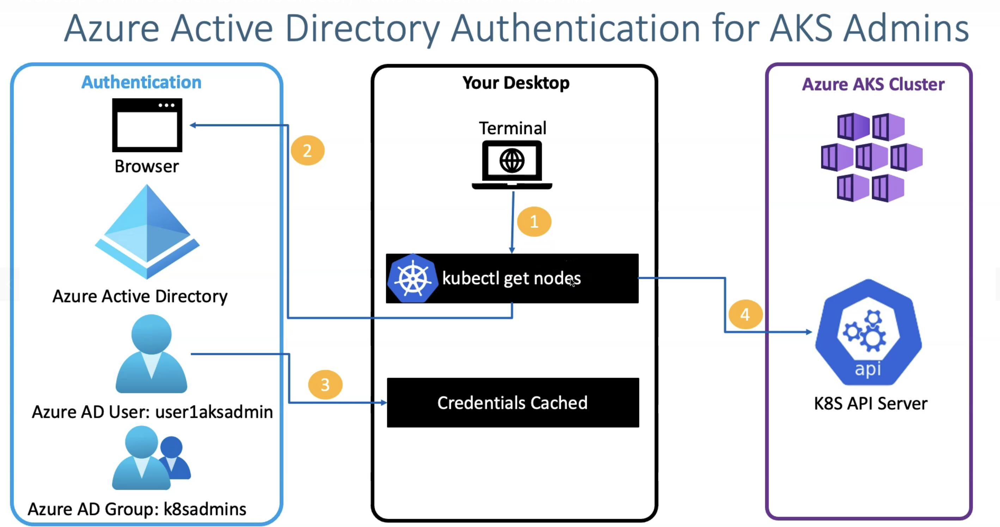
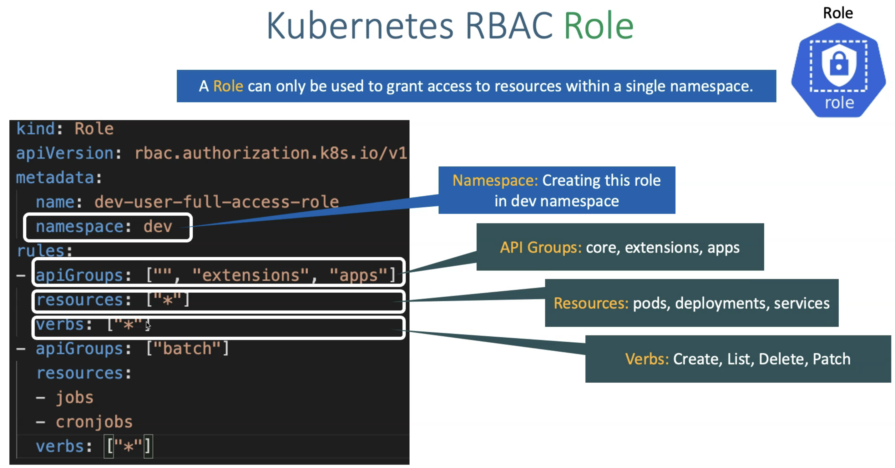
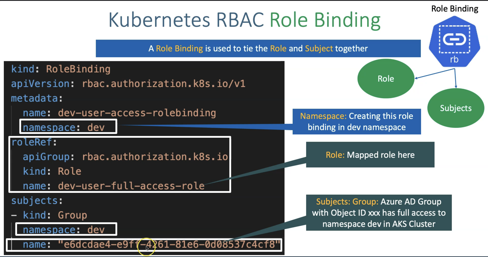
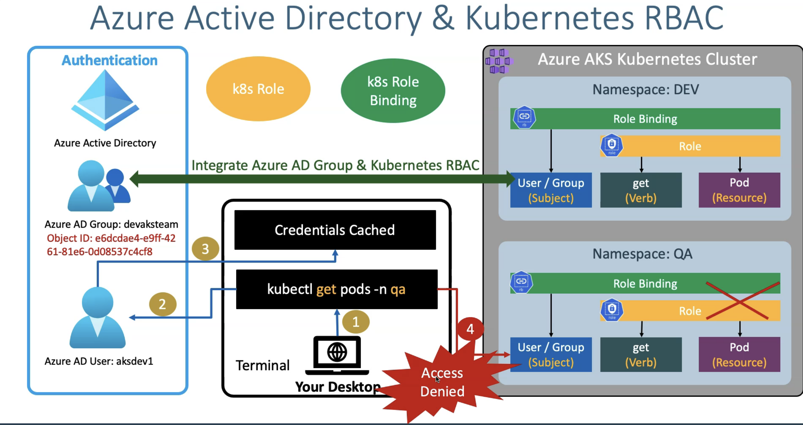
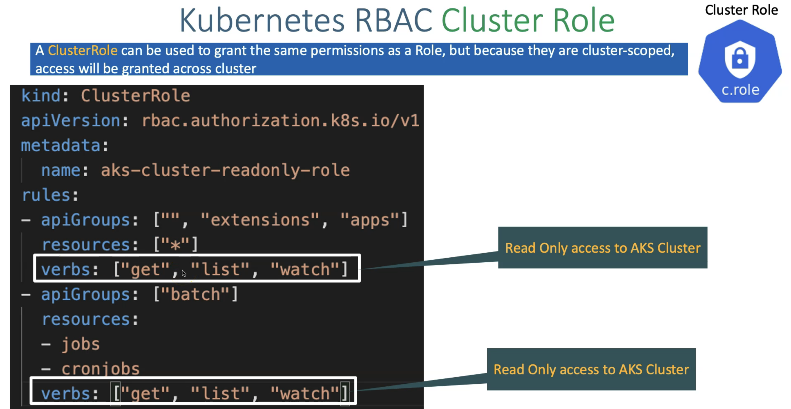
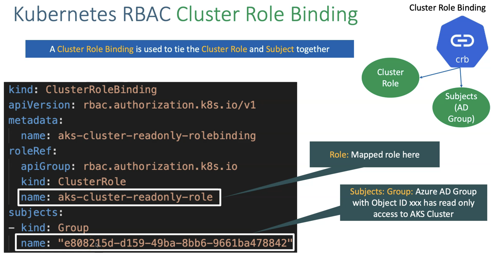
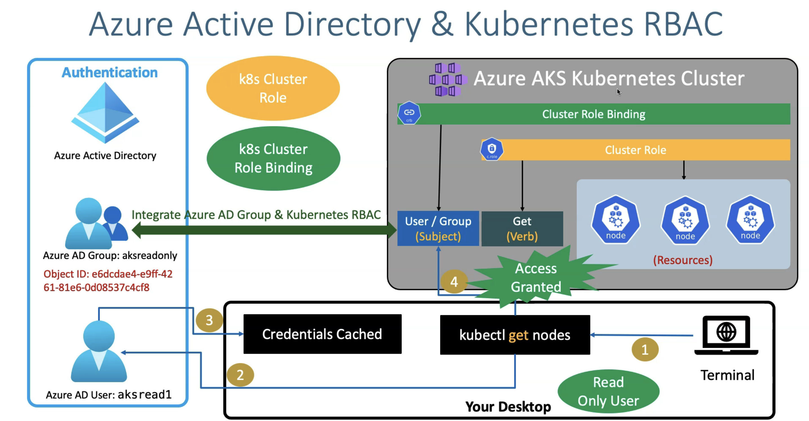

# Azure AD Authentication for AKS Cluster Admins

**Access to multiple AKS cluster**
- node logs(creds, certificates) saves in: kube config file ```$HOME/.kube/config```

- kubectl config view  // see the AKS cluster history(howmany cluster are there). 3 imp terminalogies are cluster, context, user 
- kubectl config current-context // which node you are in
- kubectl config use-context <context-name>  // switch to another node
- kubectl cluster info | kubectl get nodes // which node you are in

**Basic access to nodes**
- ``` az aks get-credentials --resource-group RG-NAME --name AKS-NAME```

## Authentication to AKS using AAD 
- authentication to AKS done via AAD 
- In AAD you have user which belongs to Admin group in AAD

**Flow**


**Idea** 
- You have users in AAD and you want to grant access to AKS with AAD, which is role based access to AKS cluster, so that user has limited access to AKS cluster based on their requirement. for example; dev users can have access to perform read access to AKS cluster, while qa and stage has maximum access based on the role attached to AAD group

**Steps**
1. Create Azure AD Group(with user role) from your main Azure portal
2. Create AAD user and assign in to the group 
    - This will generate new user with username and password. You'll use this email and password to login to AKS cluster
3. Enable AKS Cluster with AKS-managed Azure Active Directory feature
    - Azure AD authenication with Kubernetes RBAC from the Azure portal(Settings -> Configuration section)
4. Access an Azure AD enabled AKS cluster using Azure AD User
    - `az aks get-credentials --resource-group RGNAME --name CLUSTERNAME --overwrite-existing`
    - `kubectl cluster-info OR kubectl get nodes `// will give URL and code to sign in as a new AAD user 
        - this will call K8s API server, API server will allow access and refresh tokens  
5. Optional: if you want to bypass or Override AAD authnetication and use k8s admin
    - `az aks get-credentials --resource-group aks-rg3 --name aksdemo3 --admin`
    - when: your AAD is down and want to access to your Aks cluster

## AKS + Azure AD authenication + Kubernetes RBAC

**Key Concepts **
1. Role
2. Role Binding
3. Cluster Role
4. Cluster Role Binding

### Kubernetes RBAC
[](https://stacksimplify.com/course-images/azure-kubernetes-service-RBAC-1.png)
**WHAT**:
1. Subjects
    - user and processes that need access to the Kubernetes API 
    - kind: Groups, User, Service Account
2. API groups and Resources
    - the K8s objects that we grant access to 
    - API groups: core, extensions, apps, batch
    - Resources: pods, deployments, service, statefulSet
3. Verbs
    - list of actions that can be taken on a reosurce
    - create, list, watch, delete, patch, get, replace, read

### Terminalogy
1. Cluster role: **Kubernetes cluster level resources**
    - A ClusterRole can be used to grant the same permission as a Role, but because they are cluster-scoped, access will be granted across cluster
    - EX: User will have access to all the resources in cluster but restricted to perform only get, list and watch actions
2. Cluster role binding: **Kubernetes cluster level resources**
    - is used to tie the Cluster role and subject together
3. Role: **at namespace level resources**
    - a role can only be used to grant access to resources within a single namespace
4. Role Binding: **at namespace level resources**
    - is used to tie the role and subject together

    [](https://stacksimplify.com/course-images/azure-kubernetes-service-RBAC-2.png)

### Examples:
**Role and Role Binding** 
1. Provide access to(Azure Group Users) **specific namespace** in AKS using Kubernetes RBAC **role and role binding**
    - Role: this is list of permissions that someone can perform on a AKS cluster
    - Role Binding: is a subject(Someone) who perform the actions on AKS cluster. ex: Azure group(having users) is the subject
    
    **RBAC Role**
    
    
    **RBAC Role Binding**
    
    
    **RBAC Role Binding Complete View**
    

**How - Steps**
Task: Create a Azure group, create Azure users, assign role to Azure group 
1. Create AD Group, Role Assignment and User for Dev - Azure side
    - Create Azure gorup
    - Create Azure role: "azure kubernetes cluster user role"
        - Scope: AKS cluster ID
    - Create user 
        - Associate this user into Azure group
2. Create Kubernetes RBAC Role & Role Binding from manifests

**ClusterRole and ClusterRole Binding**
1. Provide access to(Azure Group Users) **specific AKS cluster** in AKS using Kubernetes RBAC **clusterrole and cluster role binding**
    - What: This is similar to role and role binding. Only difference is, this operates at cluster level. so you can list, read, create, delete on a cluster level.
    
    **RBAC Cluster Role**
    
    
    **RBAC Cluster Role Binding**
    
    
    **RBAC Cluster Role Binding Complete View**
    

**How - Steps**
Task: Create a group in Azure with a role. Create a Kubernetes RBAC role that has only read level access to Kubernetes Cluster 

1. Create AD Group, Role Assignment and User for Dev - Azure side
    - Create Azure gorup
    - Create Azure role: "azure kubernetes cluster user role"
        - Scope: AKS cluster ID
    - Create user 
        - Associate this user into Azure group
2. Create Kubernetes RBAC Role & Role Binding from manifests

# Callouts 
1. AAD with AKS: who can access to AKS nodes
2. AAD + Kubernetes RBAC + AKS: who can access kubernetes (resources) namespaces and perform actions on AKS cluster -  to limit access to cluster resources based a user's identity or group membership.
    - Role(K8s resources access criteria: who can do which actions) and Role Binding(which users perform which actions) 
    - firstly user will have access to K8s cluster but are restricted to see resources 
    - secondly, you define role - i.e. setting up a criteria on who can perform which action on K8s cluster. - **at namespace level resources**
    - Thirdly, you combine role and User/Group - i.e. this user/group will perform actions on this K8s cluster

##### Extra Links
https://github.com/gautampambhar/azure-aks-kubernetes-udemy/tree/master/21-Azure-AKS-Authentication-and-RBAC/21-02-AzureAD-Authentication-for-AKS-Admins

https://github.com/gautampambhar/azure-aks-kubernetes-udemy/tree/master/21-Azure-AKS-Authentication-and-RBAC/21-03-Kubernetes-RBAC-with-AzureAD-on-AzureAKS
