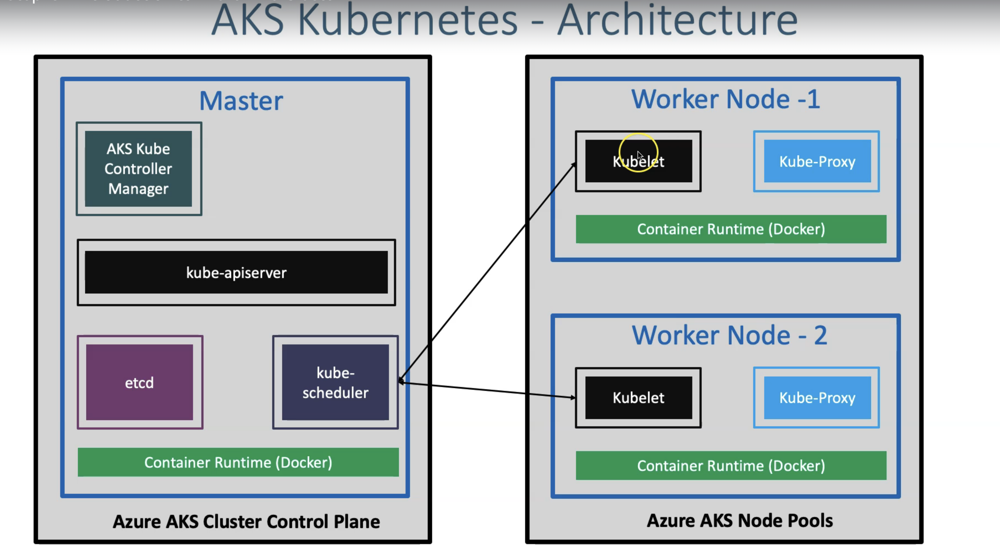
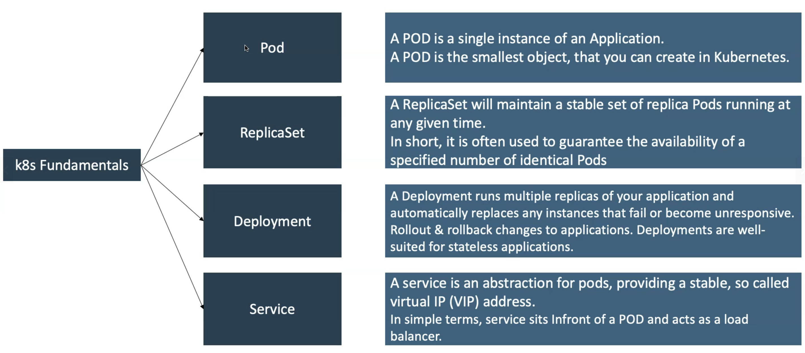
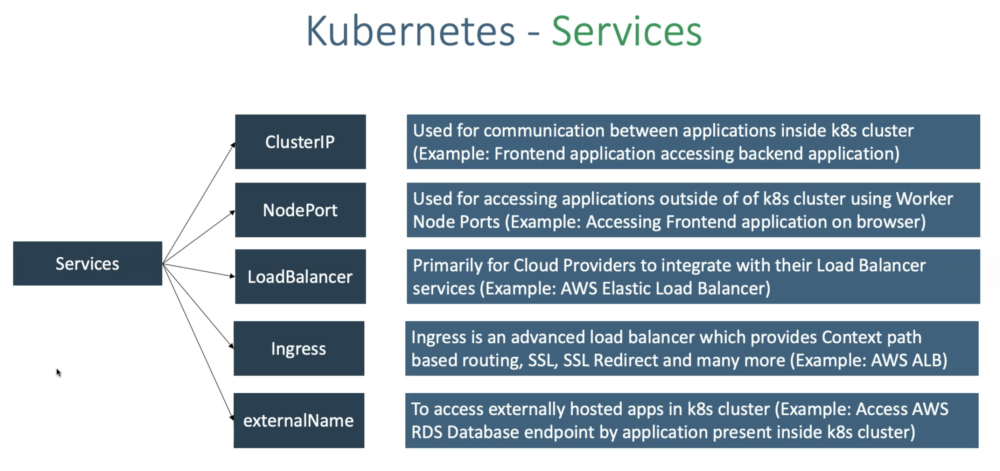
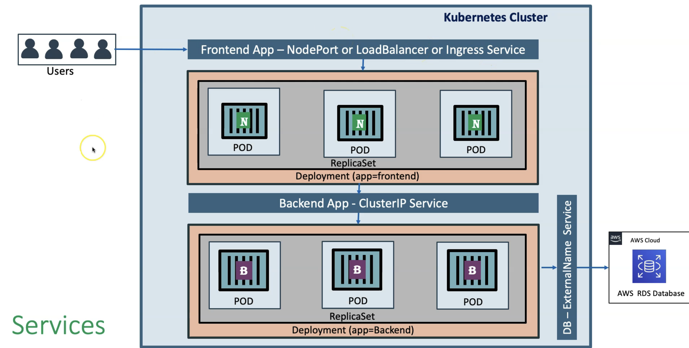
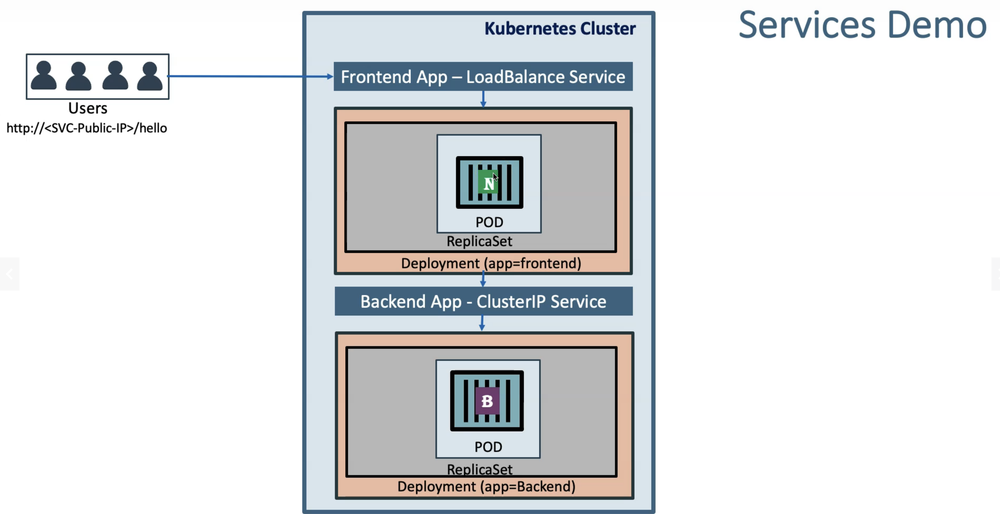

# 01 - What is AKS - Azure Kubernetes Service
- AKS is highly available, secure and fully managed Kubernetes Service
- As on today available in 36 regions and growing.
- When compared to other cloud providers, AKS is the one which is available in highest number of regions
- Will be able to run any type of workloads
    • Windows based applications like .Net Apps
    • Linux supported applications like Java
    • IOT device deployment and management on demand
    • Machine Learning Model training with AKS

**Features**
**What**: Kubernetes is a portable, extensible, open-source platform for managing containerized workloads
- Out of the Box Features
- Service discovery and load balancing
- Storage orchestration
- Automated rollouts and rollbacks
- Automatic bin packing
- Self-healing
- Secret and configuration management

## 02 - K8S Architecture 
1. Master node
    - API Server
    - Scheduler 
    - Controller manager
    - ETCD
2. Worker node
    - Kubelet: Kubelet is the agent that runs on every node in the cluster. This agent is responsible for making sure that containers are running in a Pod on a node.
    - Kube-Proxy: It is a network proxy that runs on each node in your cluster and maintains network rules on nodes. In short, these network rules allow network communication to your Pods from network sessions inside or outside of your cluster.


3. Fundamentals 


## 03 - Create AKS Cluster 
1. Create Kubernetes Cluster
- **Basics**
  - **Subscription:** Free Trial
  - **Resource Group:** Creat New: aks-rg1
  - **Kubernetes Cluster Name:** aksdemo1
  - **Region:** (US) Central US
  - **Kubernetes Version:** Select what ever is latest stable version
  - **Node Size:** Standard DS2 v2 (Default one)
  - **Node Count:** 1 // 1 server/workernode = system node
- **Node Pools**
  - leave to defaults // VMSS
- **Authentication**
  - Authentication method: 	System-assigned managed identity
    - You can use either service principal or SAMI
    - **Why SAMI:** Clusters using service principals eventually reach a state in which the service principal must be renewed to keep the cluster working. Managing service principals adds complexity, which is why it's easier to use managed identities instead. The same permission requirements apply for both service principals and managed identities.
  - Rest all leave to defaults
- **Networking**
  - **Network Configuration:** Advanced
  - **Network Policy:** Azure
    - **What**: this installs the Azure container network interface plugin which gives you enhanced performance 
  - Rest all leave to defaults
- **Integrations**
  - Azure Container Registry: None
  - leave to defaults
- **Tags**
  - leave to defaults
- **Review + Create**
  - Click on **Create**

**End**
1. This will create Azure standard LB with public IP for your K8S cluster

## 04 - Access to AKS: Configure kubectl to connect to AKS Cluster
**What**: run this command on your laptop to connect to AKS cluster 
**How**: It creats the kube config file(this contains credentials downloaded for K8S Cluster) in your laptop `/Users/gautam/.kube/config` 
```
# Template
az aks get-credentials --resource-group <Resource-Group-Name> --name <Cluster-Name>

# Replace Resource Group & Cluster Name
az aks get-credentials --resource-group aks-rg1 --name aksdemo1

# List Kubernetes Worker Nodes
kubectl get nodes 
kubectl get nodes -o wide
```

## 05 - Local Desktop - Install Azure CLI and Azure AKS CLI
```
# Install Azure CLI (MAC)
brew update && brew install azure-cli

# Login to Azure
az login

# Install Azure AKS CLI
az aks install-cli

# Configure Cluster Creds (kube config)
az aks get-credentials --resource-group aks-rg1 --name aksdemo1

# List AKS Nodes
kubectl get nodes 
kubectl get 
```
## 06 - Deploy an App via deployment and service(LB)
1. you have worker node
2. you deploy nginx to host static content of your application - create pod, replicaset via deployment, service 
  1. **Service**: When we deploy k8s load balancer service, the following will happen in Azure Standard Load Balancer
    • A new Public IP gets created and associates that to Frontend IP Configuration
    • A new Load Balancing rule will be created which associates frontend ip and backend pool
    
    - **Example - 2 - ExternalName**: 
    - **Example - 3 - ClusterIP**: 
      - User --> frontend LB service --> frontend deployment --> backend ClusterIP service --> backend deployment
      - **How**: 
        1. create backend deployment and clusterIP service
        2. create frontend app - reverse proxy app: deployment & LB service
          - frontend **deployment** is a reverse proxy app. Inside Deployment, we'll provide backend cluster IP service name 
            - so when request comes to frontend deployment it will redirect it to the backend clusterIP service
          - Create LB service 
  2. **Replicaset**: Horizontal pod autoscaler to autoscale the pod

## 07 - Install Ingress Controller 
```t
# Get the resource group name of the AKS cluster 
az aks show --resource-group aks-rg1 --name aksdemo1 --query nodeResourceGroup -o tsv

# TEMPLATE - Create a public IP address with the static allocation
az network public-ip create --resource-group <REPLACE-OUTPUT-RG-FROM-PREVIOUS-COMMAND> --name myAKSPublicIPForIngress --sku Standard --allocation-method static --query publicIp.ipAddress -o tsv

# REPLACE - Create Public IP: Replace Resource Group value
az network public-ip create --resource-group MC_aks-rg1_aksdemo1_centralus --name myAKSPublicIPForIngress --sku Standard --allocation-method static --query publicIp.ipAddress -o tsv
```
- Make a note of Static IP which we will use in next step when installing Ingress Controller
```t
# Make a note of Public IP created for Ingress
52.154.156.139
```

## Step-07: Install Ingress Controller
```t
# Install Helm3 (if not installed)
brew install helm

# Create a namespace for your ingress resources
kubectl create namespace ingress-basic

# Add the official stable repository
helm repo add ingress-nginx https://kubernetes.github.io/ingress-nginx
helm repo update

#  Customizing the Chart Before Installing. 
helm show values ingress-nginx/ingress-nginx

# Use Helm to deploy an NGINX ingress controller
helm install ingress-nginx ingress-nginx/ingress-nginx \
    --namespace ingress-basic \
    --set controller.replicaCount=2 \
    --set controller.nodeSelector."kubernetes\.io/os"=linux \
    --set defaultBackend.nodeSelector."kubernetes\.io/os"=linux \
    --set controller.service.externalTrafficPolicy=Local \
    --set controller.service.loadBalancerIP="REPLACE_STATIC_IP" 

# Replace Static IP captured in Step-02 (without beta for NodeSelectors)
helm install ingress-nginx ingress-nginx/ingress-nginx \
    --namespace ingress-basic \
    --set controller.replicaCount=2 \
    --set controller.nodeSelector."kubernetes\.io/os"=linux \
    --set defaultBackend.nodeSelector."kubernetes\.io/os"=linux \
    --set controller.service.externalTrafficPolicy=Local \
    --set controller.service.loadBalancerIP="52.154.156.139"     


# List Services with labels
kubectl get service -l app.kubernetes.io/name=ingress-nginx --namespace ingress-basic

# List Pods
kubectl get pods -n ingress-basic
kubectl get all -n ingress-basic


# Access Public IP
http://<Public-IP-created-for-Ingress>

# Output should be
404 Not Found from Nginx

# Verify Load Balancer on Azure Mgmt Console
Primarily refer Settings -> Frontend IP Configuration
```

## Step-8: Create External DNS Manifests
- External-DNS needs permissions to Azure DNS to modify (Add, Update, Delete DNS Record Sets)
- We can provide permissions to External-DNS pod in two ways in Azure 
  - Using Azure Service Principal
  - Using Azure Managed Service Identity (MSI)
- We are going to use `MSI` for providing necessary permissions here which is latest and greatest in Azure as on today. 

**Steps**
1. Create azure.json file
```json
{
  "tenantId": "c81f465b-99f9-42d3-a169-8082d61c677a",
  "subscriptionId": "82808767-144c-4c66-a320-b30791668b0a",
  "resourceGroup": "dns-zones", 
  "useManagedIdentityExtension": true,
  "userAssignedIdentityID": "404b0cc1-ba04-4933-bcea-7d002d184436"  
}
```
2. Create managed Identities: to allow access for External DNS to Azure DNS zone
  - Add role: contributor
  - Update this identity ID in to azure.json
3. Add this identity to VMSS 
  - identity --> user-assigned --> associate 

## Step-9: Create Ingress SSL: Cert manager and Let's incrypt 
1. Install Cert manager using helm: is a native Kubernetes certificate management controller which helps with issuing certificates from a variety of sources(Let's incrypt ). It will ensure certificates are valid and up to date, and attempt to renew certificates at a configured time before expiry.
  - Cert manager, takes generated CSR certificate and submit to Let's incrypt automatically
2. use TLS options in ingress service to create domain specific **Secret**. each domain will have their own secret
3. Configure cert manager to use let's encrypt as certificate provider. 
  - Cert manager will submit the CSR to Let's incrypt and get the certs from Let's incrypt and then apply certs to our application


1. create aks cluster 
2. application deployment 
  1. Nginx ingress controller 
    1. Create PIP
    2. install helm
    3. install nginx ingress
  2. install externalDns
  3. Cert Manager