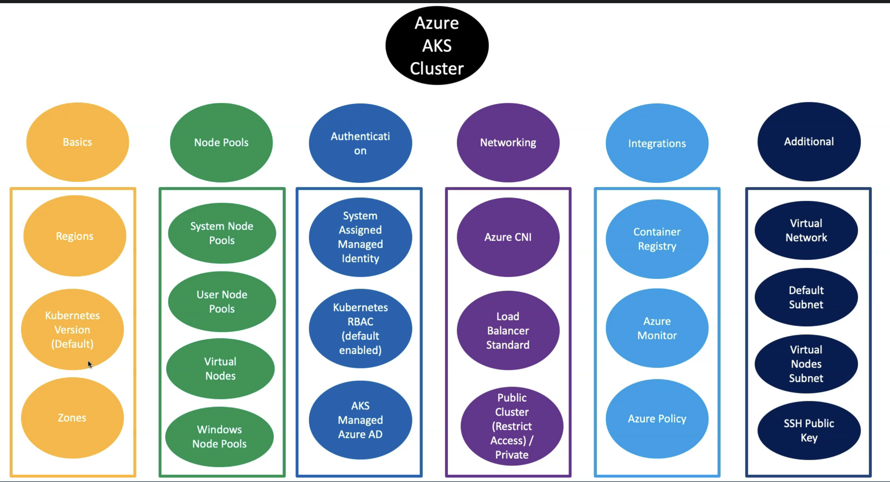
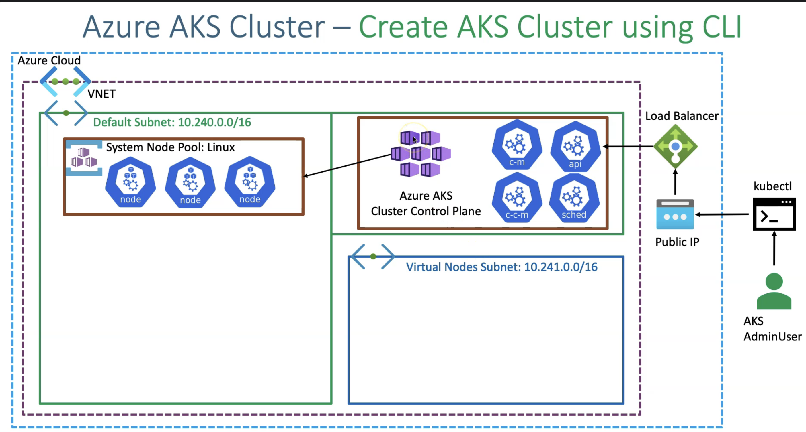
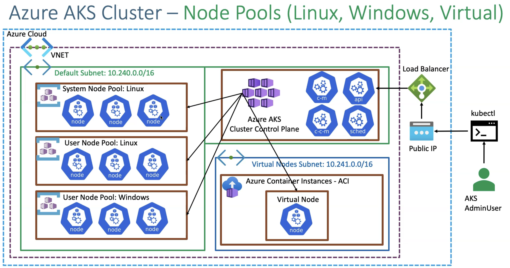
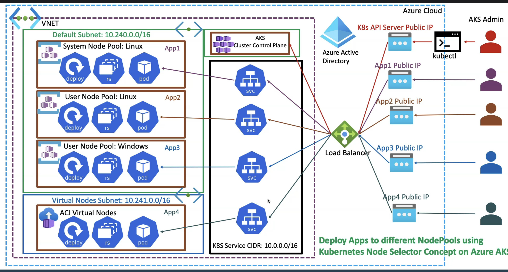
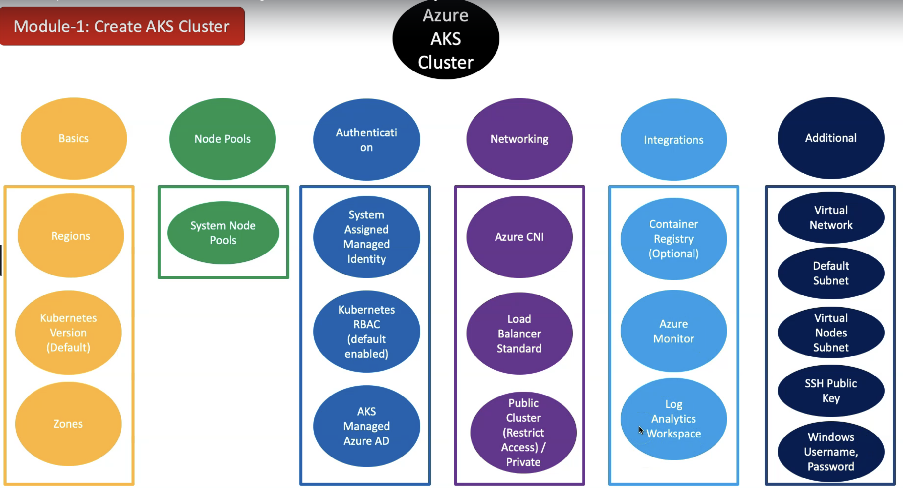
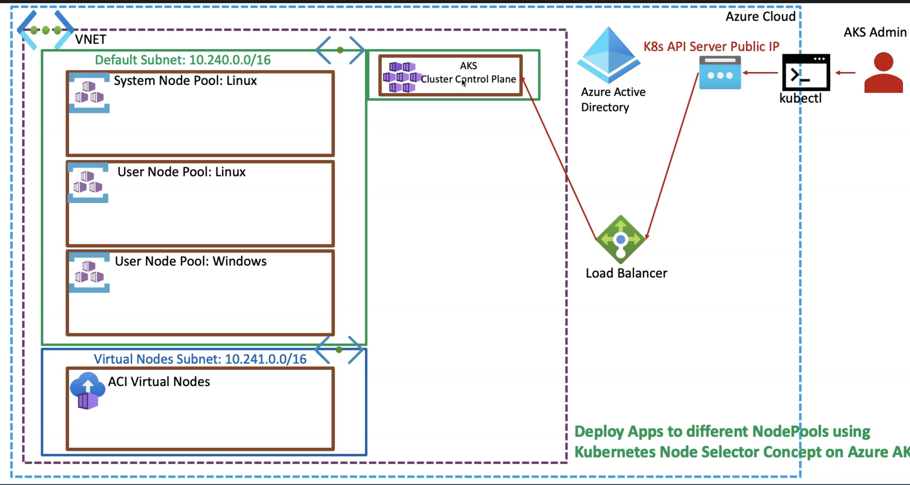
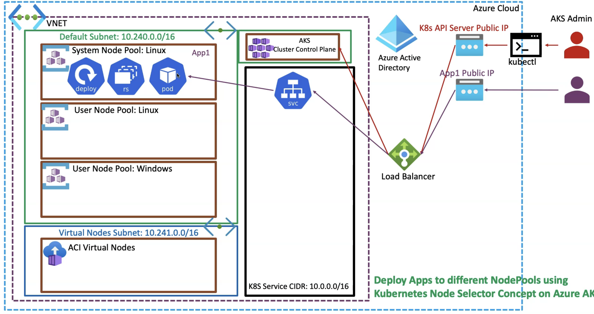
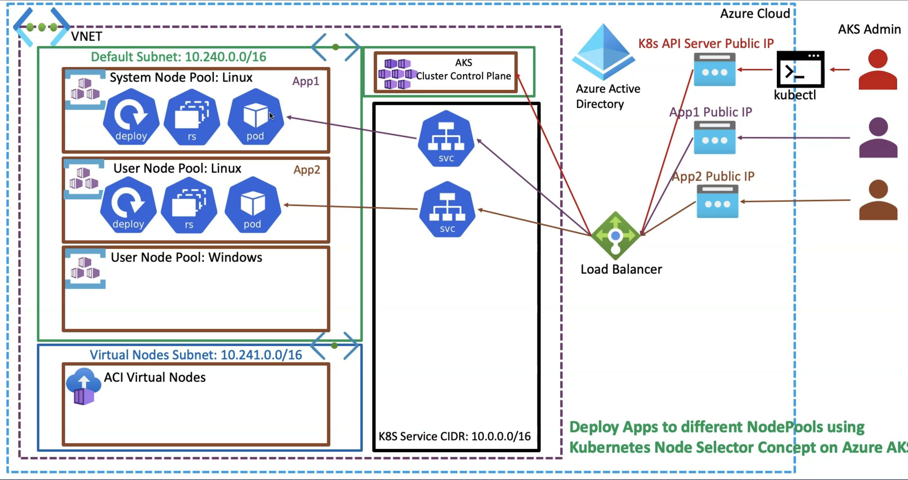

# DECISIONS 

## Core Decisions
1. Basic
    1. region: in which region you want your clusters
    2. Kubernetes Version:
    3. Zones: node pools in how many zones. Azure by default provides 3 zones. for higher availibility you can decide in howmany zones you want your node pool in
2. Node pools:  
    1. System node pool: gets created by default when you create AKS cluster
        - what: 
            - This is a system node pool with multiple worker node 
            - cluster control plane component(minimum component) will also created on System node pool
            - you run system-related workloads, such as, ACS connector, Kube DNS, Code DNS
            - You could run your application workloads on system node pool. but it's not recommended(by far we have use this approach)
        - Pay: not free
    2. User node pool: run your application workloads
        - type: windows and Linux
    3. Virtual nodes: virtual nodes only on Linux serverless infrastruture  
3. Authenitcation:
    1. type: 
        - choose from System assigned managed identity(recommended) or Service principal
        - Kubernetes RBAC: 
            - what: enabled by default when you create an AKS cluster 
            - why: effective management of role based access control for the Kubernetes resources 
        - AKS managed Azure AD: optional
            - Catch: once you enable it, it can't be disabled 
4. Networking:
    1. Azure CNI: always use this to obtain high performance
    2. Kubenet networking: by default created. not recommended 
    3. Load balancer standard: by-default created. decide options here; outbound traffic 
        - Outbound traffic(AKS cluster application needs to access outside of the cluster resources(which is not Azure cloud), then how much network bandwidth you have provided on the load balancer standard is the core thing.
        - Concepts: S-Net concepts and outbound IPs.
        - TODO: design your load balancer standard with enough outbound IPs for your outbound connections if you are using it in production grade and if you have outbound heavy traffic.
    4. Public cluster (restrict access)/ Private: 
        - Public cluster: enable this if you need to access your cluster from a public network.
            - if you have public cluster, Azure still provides restrict access. where specific IPs only have access to the cluster, rest of IPs are defined
        - Private: if you don't want your K8s API server to be exposed from public network then use this
5. Integration: 
    1. Container registry
        - how: 
            - service principal
            - direct-attach with AKS 
    2. Azure monitor 
        - by default enabled when creating a cluster from Azure portal
        - with Azure CLI, you need to ensure that this sets enabled 
    3. Azure policy: additonal security 
6. Additional
    1. Virtual Network: Use your own VNet instead of AKS creating VNet for us. 
    2. Deafualt Subnet: 
    3. Virtual Node Subnet:
    4. SSH Public Key:

## Implementation
1. Section 1: Create AKS cluster
    
2. Section 2: Create Windows, Linux User Node Pools and Virtual Nodes
     
3. Section 3: Deploy Apps to all 4 node pools using Kubernetes Node selector concept
    

## Let's Deploy

1. Module 1 

2. Module 2

## Module resources
1. Module 1 
    1. Resource group 
        - AKS cluster 
        - Vnet 
    2. Vnet with 2 subnet 
        - subnet 1 for AKS 
        - subnet 2 for Virtual node(to deploy serverless infra)
    3. Azure AD Group and User
        - to access K8s cluster 
    4. SSH keys
        - for nodes to use this keys, use this keys to SSH into nodes
        - create it on your machine and then give key path to AKS creation
        - pub file will be pushed inside the respective AKS cluster(liunx vm), and private key is to access the VM using SSH terminal
    5. Log Analtics Workspace
        - to enable monitoring
        - why: Azure Monitor for Containers, also known as Container insights feature provides performance monitoring for workloads running in the Azure Kubernetes cluster.
    6. Set Windows Username Passwords
    7. Create AKS Cluster with **System Node Pool**
    8. Configure Credentials & test
2. Module 2: Create **User Node Pool** to deploy Application Workloads
    1. Create/Enable Virtual Nodes on AKS Cluster 
        - Troubleshoot Virtual Nodes ACI Pods
    2. Create a Node Pool Linux User 
    3. Create a Node Pool for Windows Apps
    
3. Deploy Apps on all the Nodes
    
    
    