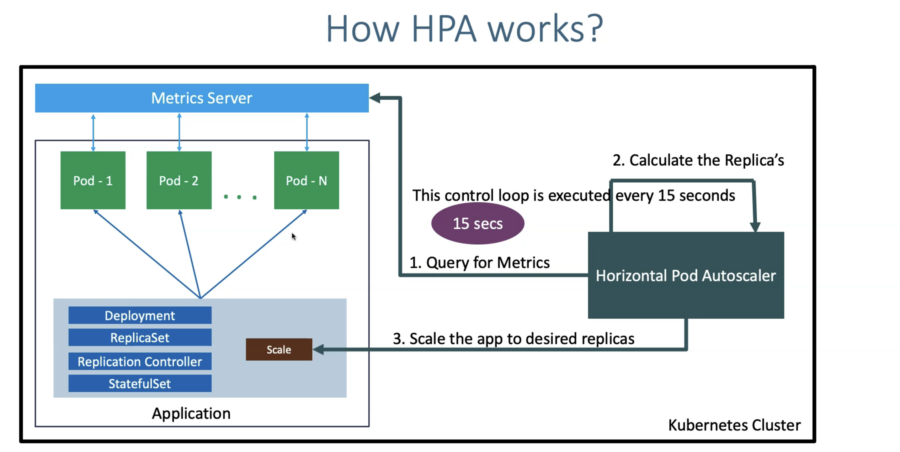

# AKS Autoscale Concepts 

## Cluster Autoscale

**What**: Scale cluster(system/node pool)

**When**:
    - when resources(pods) are failed to run due to insufficient resources - Scale Out 
    - when nodes are underutilized for an extented period of time and their pods can be placed on other existing nodes - Scale In

**How**: Cluster Autoscale fetaure 
    - each node gets autoscale feature // autoscale per node

**Test**:
- Apply/Set container resource request and limits
- In order to test autoscale, scale your pod from replicaset 1 to 20. 
- Since each container uses certain memory and cpu, it will need additional compute when scaling to 20 replicaset

## Horizontal pod Autoscaler - HPA

**What**: increasing and decreasing the number of replicas(pods)
- It automatically scale the numner of pod in deployment, replication controller, or replica set, stateful set based on the resource's **CPU Utilization**
- Scale out and Scale In capabilities 

**How**: set target CPU utilization percentage 
- Pod send data to "Metrics Server" 
- Enable HPA for respective application, it will keep query for metrics from "Metrics Server" 
- HPA will calculate replica based on the target CPU Utilization you mentioned
- If it mets condition it will increase/decrease pods number
- Contorl loop is executed every 15 seconds 

**Architecture**: 

# Production System Design 
1. In production you should have minimum 2-3 system node pool 
