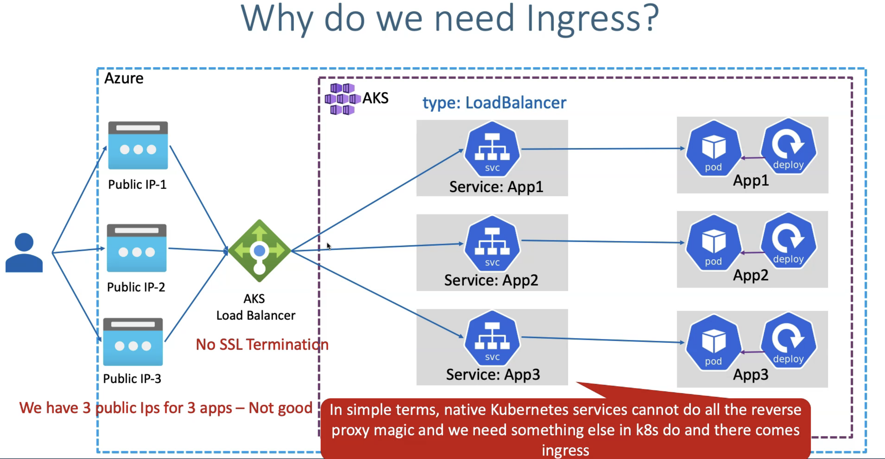
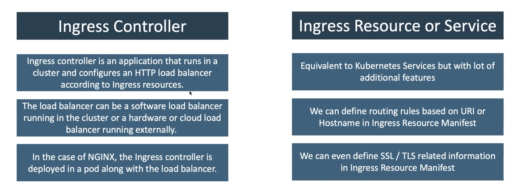
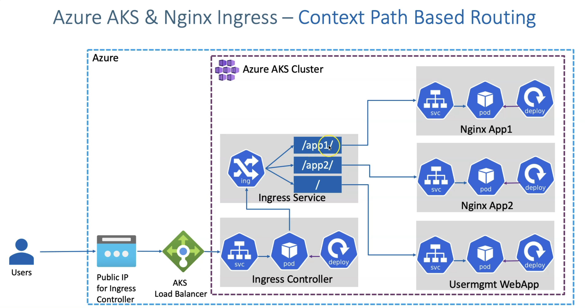
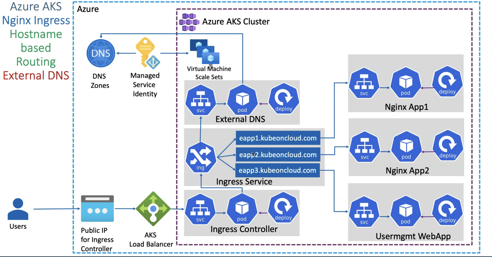
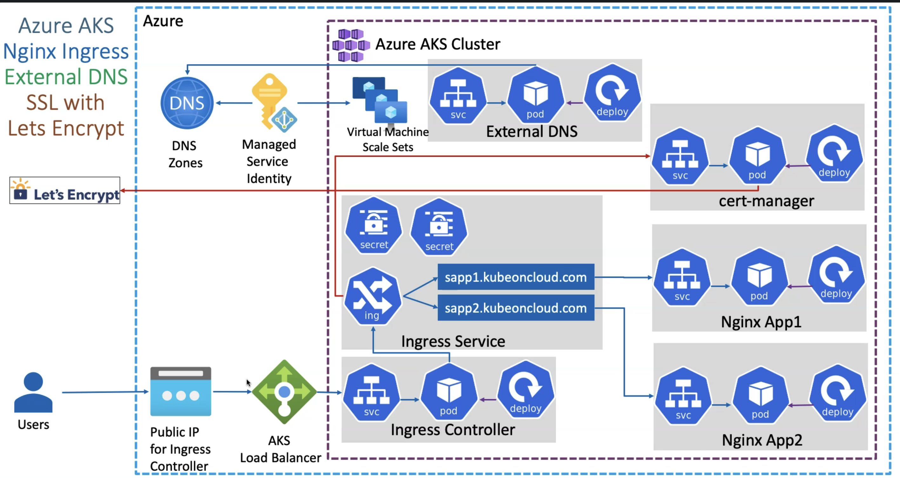

# Ingress

**WHAT**
- ingress is a Kubernetes resource that lets us configure an **HTTP load balancer for applications** running on Kubernetes with an advanced capability **at HTTP layer**.
- Entry point to cluster - for all the requests to domain and subdomain rules that you configured
- Evaluates all the rules (define in the ingress component) - you may have 50 rules or 50 ingress component created in the cluster. So this Evaluates and decides which forwarding rule applies for that specific request  
- Manages redirection

**WHY**
- When you have multi microservices deployed with Kub service for each of them, it will create public address for each of them. if you want to access application using single IP instead of multiple separate service IP address, then no out of the box feature is there. 
- Azure standard LB: it doesn't have SSL termination. Because it's layer 4 LB, it only deal with the TCP traffic and not the HTTP traffic

Before Ingress

After Ingress


**Ingress**
- You need a mechanism where you have one static public IP that acts as a entry point and all your application workload services are attched to this IP.

### Features
- TLS/SSL termination(process of decrypting encrypted traffic before passing it along to a web server.) 
- Context path-based routing: URL based routing. ex: direct app1/ to certain location
- Host name-based routing: Domain name based routing. ex: list domains and route traffic based on domains

**Ingress Terminalogy**


**HOW**: Without SSL
- Create static public IP address
- Install ingress controller using Helm
    - Use Helm to deploy an NGINX ingress controller // point Static IP
- Create Application workloads
- Create ingress service(redirection of application happens here)

**Architecture**: 
1. Context-routing:  

2. Hostname routing: 

### Domain/DNS & SSL Certificate 
After purchasing domain, you need SSL cerficate from certificate authority(CA) to encrypt, authentication and HTTPS purposes.
 

**How**: CA(let's encrypt, harshi corp) issue and sign the certificate and you need to install and activated on site's origin server 

## 2. Hostname routing
**Steps**
1.  you create domain(DNS) in AWS/GoDaddy - atleast 1
    - delegate the domain name in Azure DNS zone
2.  you manage the domain on Hosted Zone in Azure
    - say you have 2 host name in your ingress service and that hosts needs to be updated in the Azure DNS host as a record
3.  Install **External DNS** 
    - **What**: (from Kubernetes itself, it is going to **register your DNS host** listed in your ingress file to the Azure Hosted Zone, whenever you deploy your Ingress manifest. We don't need to go to DNS Zones and add the record sets for our applications. Automatically, external DNS is going to do for us)
    - Steps: Implemenet following steps
    1. **Quetion**: how we are going to add all these three record sets(ex: 3 service with 3 host name) in DNS Zones (since DNS zone is Azure service, AKS needs to talk to this service)  
    2. **MSI**: how the permission from Azure AKS cluster to DNS Zones for this respective part to add DNA Zones using manager service identity. Create MSI with contributer role and get the MSI ID.
    - **How-Flow**
    1. whenever we create an Ingress resource, it is going to create three(example) DNS names,
    2. and those three DNS names are going to be registered to DNS Zones with a record set here.
    3. And in addition to that, whenever you access eapp1 it goes to App1, eapp2.kubeoncloud.com, it goes to App2, and eapp3.kubeoncloud.com, will go to App3, whatever it is, user management web app.
    - **How-Steps**
    1. Create azure.json
    2. Create MSI 
        - Get the MSI id and supply it in the azure.json
    3. Create external-dns.yml menifest 
4. **SSL**: application needs SSL to incrypt data. 
    1. Get the valid SSL certificate for all your applications 
    2. Automatically renew it
    - **Let's incrypt**: is a Certificate Authority that provides free TLS/SSL certificate using the ACME (Automatic Certificate Management Environment ) protocol 
        - **How**: by running a **certificate management agent** on the web server. First, the agent proves to the CA that the web server controls a domain. Then, the agent can request, renew, and revoke certificates for that domain.
    - **Cert-manager**: is a native Kubernetes certificate management controller which helps with issuing certificates from a variety of sources. It will ensure certificates are valid and up to date, and attempt to renew certificates at a configured time before expiry. 
        - Cert manager, takes generated CSR certificate and submit to Let's incrypt automatically
    - **CALLOUTS**: so whenever you create Ingress manifest, it creates the certificate-related secrets for your sapp1 and sapp2. And then those SSL certificates, it will generate a CSR and using the Cert-manager, it will submit to Let's Encrypt automatically and then it will bring the valid SSL certificates and then deploy on our Kubernetes for our applications. so your application got the SSL certificates in the background automatically.

#### Host Name routing - TODO 1
What you already have 
- IP address
- Ingress controller installed
- Ingress service (with 3 application)

What you need
- External DNS: to update records in Azure DNS zone
- SSL certificate for your applications 

**Flow**
1. Public IP
2. Ingress with associated public IP
3. External DNS (MSI + manifest)
4. Install cert-manager 
5. Deploy Application workload
6. Deploy Ingress service (with TLS settings to create secrets for apps using TLS)
    - it will go through External DNS and register applications related DNS records sets in Azure DNS Zones
    - It will go to cert manager(since we created TLS enabled in our template), from there it will go to Let's Incrypt to submit CSR there, get the Certificate from there and apply into our app

**Steps**
1. Create a domain name 
2. Create Azure DNS zone
    - delegate domain name in Azure DNS zone
    - have: you have 2 host in ingress
3. Install External DNS
    - **What**: takes your 2 host in your ingress(eapp1.gautamprojects.tech and eapp2.gautamprojects.tech) and update it's record set in Azure DNS host automatically
        - Host name will be **automatically DNS registered inside the DNS zones**
        - Which means **its record set is created automatically** 
    - Need permission: **MSI** 
4. Create MSI: this is permission needed from AKS to take ingress host and update it in the Azure DNS zone
    - Create MSI in Azure // take client id and paste it in the azure.json file
    - In the MSI, add "Azure role assignement"
        - Scope: RG
        - RG: DNS-Hosted RG
        - Role: contributor
    - Create azure.json file
    - In Azure, VMSS --> identity --> add a created identity in the "user assigned" tab
5. Deploy External DNS: inorder for External DNS to work
    - manifest file: `external-dns.yml` 
6. Cert manager: To enable SSL cert automatically; Issuing certificates from a Let's incrypt
    - link: https://medium.com/nerd-for-tech/k8s-cert-manager-and-lets-encrypt-a05f4d724927
    - it submit the CSRs to Let's incrypt and gets and apply certificate to our DNS host
    ### Cert-manager steps 
    1. install cert manager using helm package manager
        - create a namespace for cert-manager
        - install helm 
        - Add the jetstack helm repository
        - update the helm repositories
        - Install the cert-manager using helm package manager
    2. deploy a cert-manager issuer 
        - Create a yaml file include setup issuer K8s component
        - Deploy the issuer on your app namespace using kubectl
        - configure our ingress rule to use the issuer and defined a name for the new generated certificate
    3. deploy the ingress rule
    4. flow: ingress service with TLS setting --> cert-manager --> let's incrypt 

## Setup Practice - TODO
Where: ```azure-aks-azcicd-deploy/all-projects/ingress/README.md```
1. Create a static IP address(instead of using bydefault IP address that is created with AKS)
    - you'll need to associate this IP with ingress contorller during installation
2. Deploy Ingress controller // in separate namespace
    - Deployment + Service // This will created automatically
    - TODO: when installing Ingress using Helm, associate public IP created in the step 1
3. Deploy your application(deployment and service(Cluster IP - type))
4. Ingress service
    - this will create root context // menaing anything coming from the public IP, send it to the app1 through Ingress controller --> Ingress service(/ - root context)
    **Exercise**
    1. route trrafic to single app
        - Ingress service - `path: /`
    2. route traffic to multiple app via context based routing 
        - Ingress service - `path: /app1`,  `path: /app2`
    3. route traffic to multiple app via host name based routing 

## Terminalogies
Delegate Domain to Azure DNS
1. Domain: is a unique name in the domain name system. ex: gautampambhar.com
    - gautampambhar.com may contain several DNS records such as: mail.gautampambhar.com, www.gautampambhar.com, info.gautampambhar.com
2. DNS Zone: is used to host **DNS record** for a perticular domain

3. Azure Domain
- Azure is not a Domain Registrar(AWS is)
- Azure DNS allows you to host a **DNS zone** and manage the DNS record for a domain in Azure 

What is delegating domain 
- change nameserver from AWS to Azure nameserver

Steps
1. get a domain from AWS or GoDaddy
2. Create a hosted zone in Azure 
    - enter domain name in the Name field
3. Take name server from Azure hosted zone and update it in your domain Registrar

**Kubernetes External DNS**
External DNS allows you to control DNS records dynamically via Kubernetes resources in a DNS provider agnostic way. 

Permission via MSI: using MSI, link DNS zone and virtual machine scale set of Azure AKS cluster, stating in such a way that any of these services inside Azure AKS cluster(meaning any pod or any application hosted under the virtual machine present inside this virtual machine scale set) will be able to update.
    - Means create, update or anything it can do on the DNS zones record sets. So it can create a record set, it can delete the record set, whatever it is. All this will be achieved by MSI

**Cert Manager**
- You'll have cert manager pod running in K8s cluster 
- You'll have Kubernetes secret mounted on Kubernetes resource 
- You'll generate CSR and submit to issuers 
- Issuer will approve CSR and automatically send the required SSL certificate for us 
- Issued SSLs are applied to Ingress service 

SSL Gotchas
- Generally, You'll need x509 cert
- we're using cert manager, it has concept of certificate that defines x509 certificate. You can create this by YAML manifest
- Since we using ingress, we don't need to create yaml for certificate, we just add TLS setting in our ingress. and it will take care of generating SSL certs automatically
