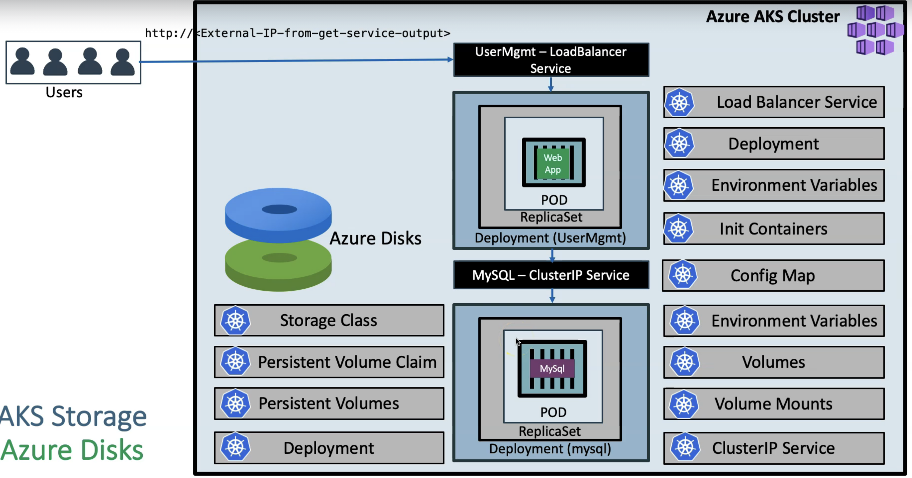
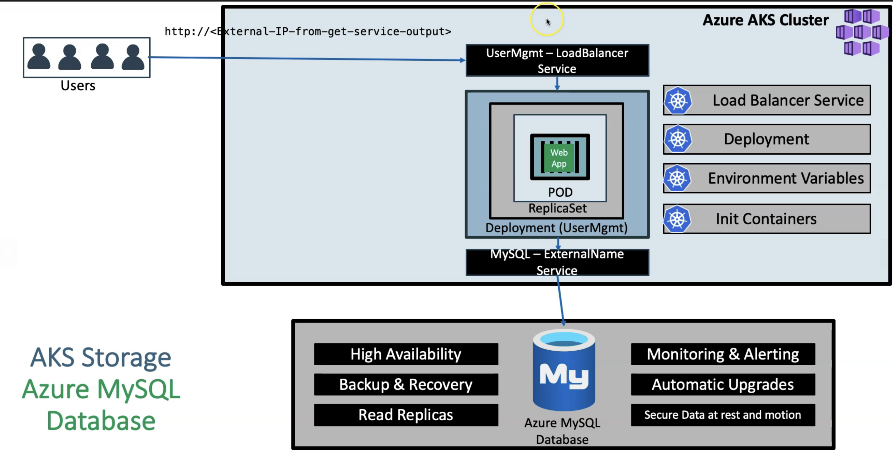

# Azure storage type 

## Concepts
1. Storage class: where you want to store data; Azure storage resource: azure-disk(Premium_LRS). This if where you define storage, such as, which Azure storage resource do you need
    - **Storage Class Manifest** - Custom class // ```azure-aks-azcicd-deploy/all-projects/local-projects/02-AzDisk-database-deploy/storage-class-manifests```
        - You will need to create storage class yaml which is custom(to your need) 
        - why custom class: you define what reclaimPolicy, volumeBindingMode, allowVolumeExpansion, parameters
    - **System Provisioned Storage Class** - AKS default class for creating workloads ```azure-aks-azcicd-deploy/all-projects/local-projects/02-AzDisk-database-deploy/system-provisioned-manifests```
        - You get default storage class with AKS so you won't need to create storage class yaml
        - why System Provisioned Storage Class: it comes with pre-configured storage settings. ex: storage gets deleted when you delete pod
2. Persistant volum claim: this will needed, storage to be created, to store data from the pod(specify how much storage you need. ex: storage: 5Gi ). This actually create storage with capacity you defined in the storage class.
    - Persistant volum: this will create storage mentioned in the pvc
4. ConfigMap: 
    - To store non-confidential data in key-value pair, 
    - Usage: pods can consume ConfigMap as environment variables, Command line Argument, configuration file in a volume
        - example-configuration file in a volume: to create default database schema in server.
        - How: Run script when pod gets cretaed(to create database schema if it doesn't exist) 
5. Db Deployment: MySql, PostGres
6. Db Service: service to connect to sql
7. Environment Variable: to connect to MySql pods
8. Init Container: only if MySql is up, then only bring the application step

# Azure storage type/class
## 1. Azure disk

**WHAT**: to store database deployment-pod data

**WHY**: pods are ephemeral. we need to persist database data

**When**: when you run database workloads it needs persistent storage 

**Architecture**: 

**Advantages**
- cost effective storage: handle unexpected traffic
- unmanched resiliency: 0% annual failure rate
- seamless scalability: dynamic scaling of disk performance on ultra disk storage
- built in securty: automatic encryption using mocrosoft managed keys or your own

#### Steps
-  ```kubectl get sc ``` - check if you have any storage class; ex: Azure, AWS
    - managed premium  
-  ```kubectl get pvc ``` - check if you have pvc and its status

**Disdvantages**
- complex setup to achieve HA, StatefulSet (master-master/master-slave setup: need to setup replication bw them)
    - only one pod can connect to one Azure disk
- no automatic backup % recovery
- no auto-upgrade MySql
- Logging and monitorning needs custom scripts

#### Connect to MySQL Database
```
# Connect to MYSQL Database
kubectl run -it --rm --image=mysql:5.6 --restart=Never mysql-client -- mysql -h mysql -p dbpassword11

# Verify usermgmt schema got created which we provided in ConfigMap
mysql> show schemas;
```

## 2. Azure MySql database

**WHAT**: External database to store database 

**WHY**: see below features

**WHY Azure Database instead of Disks**: 

**HOW to connect AKS to MySql Database**: ExternalName service 

**WHERE**: ```azure-aks-azcicd-deploy/all-projects/local-projects/03-AzSqlDb-deploy/kube-manifests/```

#### Features 
- built-in high availability 
- scale as needed within second
- secured to protect sensitive data at rest and in-motion
- auto backups and point-in time restore for up to 35 days
- enterprise grade security 

#### Create MySQL Database on Azure
- servername: akstestudemydb
- admin username: dbadmin
- admin password: elddwedf@jwis!G2

#### Connect to MySQL Database
```
# Template
kubectl run -it --rm --image=mysql:5.7.22 --restart=Never mysql-client -- mysql -h <AZURE-MYSQ-DB-HOSTNAME> -u <USER_NAME> -p<PASSWORD>

# Replace Host Name of Azure MySQL Database and Username and Password
kubectl run -it --rm --image=mysql:5.7.22 --restart=Never mysql-client -- mysql -h akswebappdb.mysql.database.azure.com -u dbadmin@akswebappdb -pRedhat1449

mysql> show schemas;
mysql> create database webappdb;
mysql> show schemas;
mysql> exit
```

## 3. Azure file

**WHAT**: to store files(static content - front end)

**WHY**: to store static content(front end - Nginx application) 

**How**: 
    - It will create **Azure storage** account and create **file shares** with menifest files // Azure file share will store our front end code-static code
    - how: volume and volume mount

**Benefits**
    - if you have multiple nginx deployment, all deployment can connect to single Azure file share, unlike azure disk which only can connect to one pod at a time. so per pod you get one disk.   

**Architecture**: 

**Type**
- custom azure file storage // ```aks-azcicd/locals/manifests/Azfile-deploy/custom-storage-manifests```
    - We will define our own custom storage class with desired permissions 
        - Standard_LRS - standard locally redundant storage (LRS)
        - Standard_GRS - standard geo-redundant storage (GRS)
        - Standard_ZRS - standard zone redundant storage (ZRS)
        - Standard_RAGRS - standard read-access geo-redundant storage (RA-GRS)
        - Premium_LRS - premium locally redundant storage (LRS)
    - system provioned azure file storage ```aks-azcicd/locals/manifests/Azfile-deploy/system-provisioned-manifests```
        - With default AKS created storage classes only below two options are available for us.
            - Standard_LRS - standard locally redundant storage (LRS)
            - Premium_LRS - premium locally redundant storage (LRS)  

#### Deployment 
- We are going to mount the file share to a specific path `mountPath: "/usr/share/nginx/html/app1"` in the Nginx container
- Flow
    - create storage class
    - PVC
    - Nginx deployment
    - Nginx service

**Advantages**
- multiple container/pod can access to single file share

#### Steps
- ``` kubectl get sc ``` : to check howmany storage class are there
    - azurefile

  
